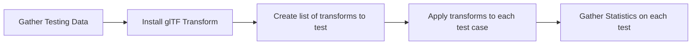

# glTF-Transform-Test

A simple pipeline to compare the effect of gltf transformation on a sample dataset.

This pipeline allows the specification of multiple transforms and sample models from the glTF Sample Models repository and utilizes transformations from the glTF Transform library.  It will run all combinations of models/transforms and provide some statistics on the differences between the optimized and original model.

## Differences analyzed

Total Mesh size
Number of Vertices
Number of Meshes

## Pipeline flow

