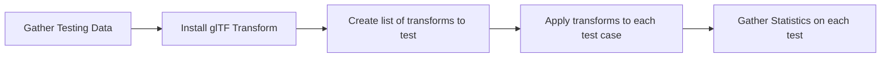

# glTF-Transform-Test

```mermaid
flowchart LR
  id1[Gather Testing Data] --> id2[Install glTF Transform]
  id2 --> id3[Create list of transforms to test]
  id3 --> id4[Apply transforms to each test case]
  id4 --> id5[Gather Statistics on each test]
```
